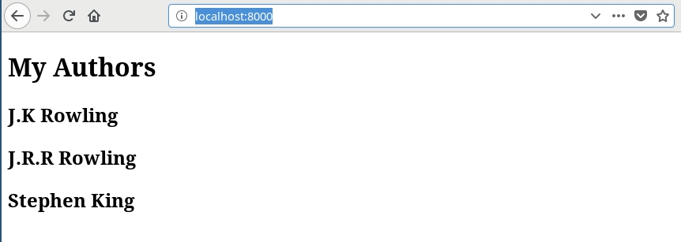

# gatsby-source-hasura

Boilerplate to get started with Gatsby, Hasura GraphQL engine as CMS and postgres as database.

# Running the app yourself

- Deploy Postgres and GraphQL Engine on Heroku:
  
  [](https://heroku.com/deploy?template=https://github.com/hasura/graphql-engine-heroku)
- Get the Heroku app URL (say `hasura-graphql-2.herokuapp.com`)
- Clone this repo:
  ```bash
  git clone https://github.com/hasura/gatsby-source-hasura.git
  cd gatsby-source-hasura
  ```
- [Install Hasura CLI](https://docs.hasura.io/1.0/graphql/manual/hasura-cli/install-hasura-cli.html)
- Goto `hasura/` and edit `config.yaml`:
  ```yaml
  endpoint: https://hasura-graphql-2.herokuapp.com
  ```
- Apply the migrations:
  ```bash
  hasura migrate apply
  ```
- Run the app (go to the root of the repo):
  ```bash
  HASURA_GRAPHQL_URL=https://gatsby-ser.herokuapp.com/v1alpha1/graphql npm run develop
  ```
- Test the app
  Visit [http://localhost:8000](http://localhost:8000) to view the app

  
